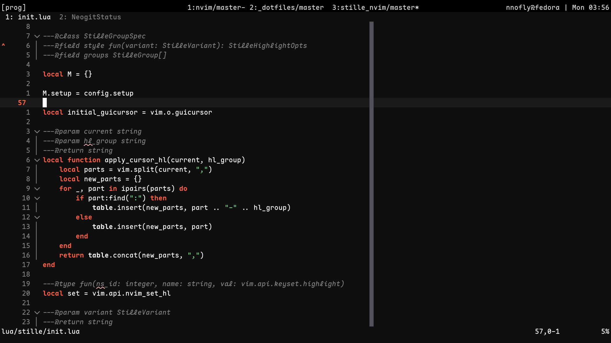
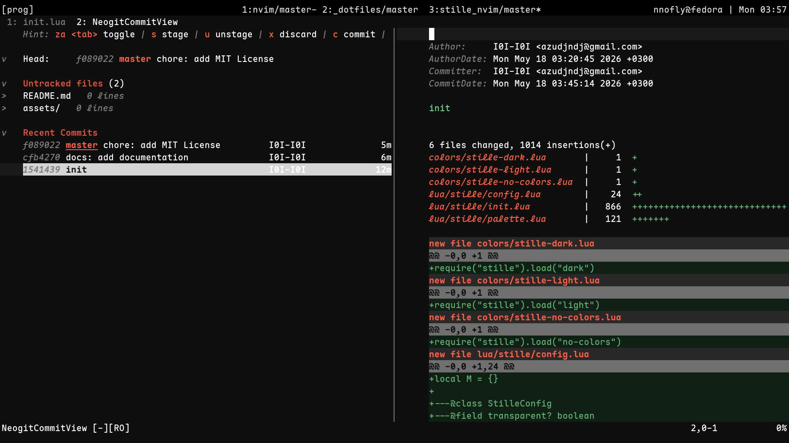
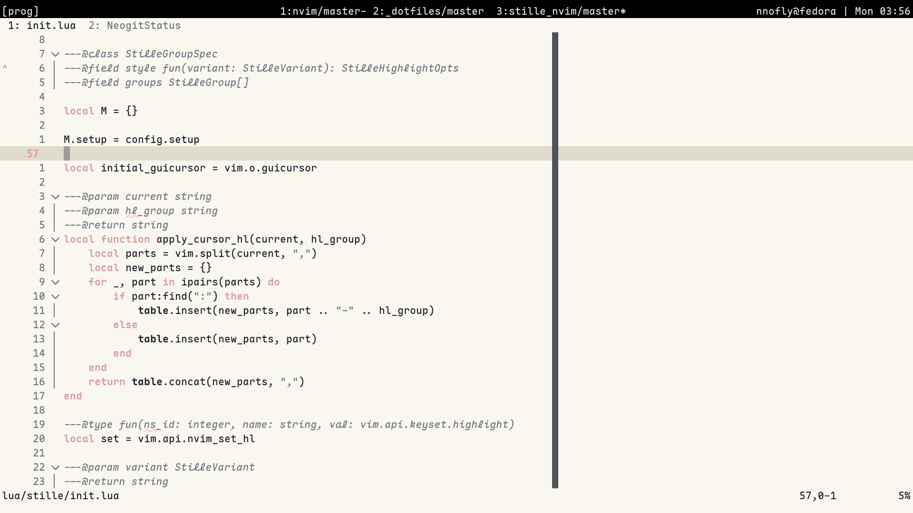
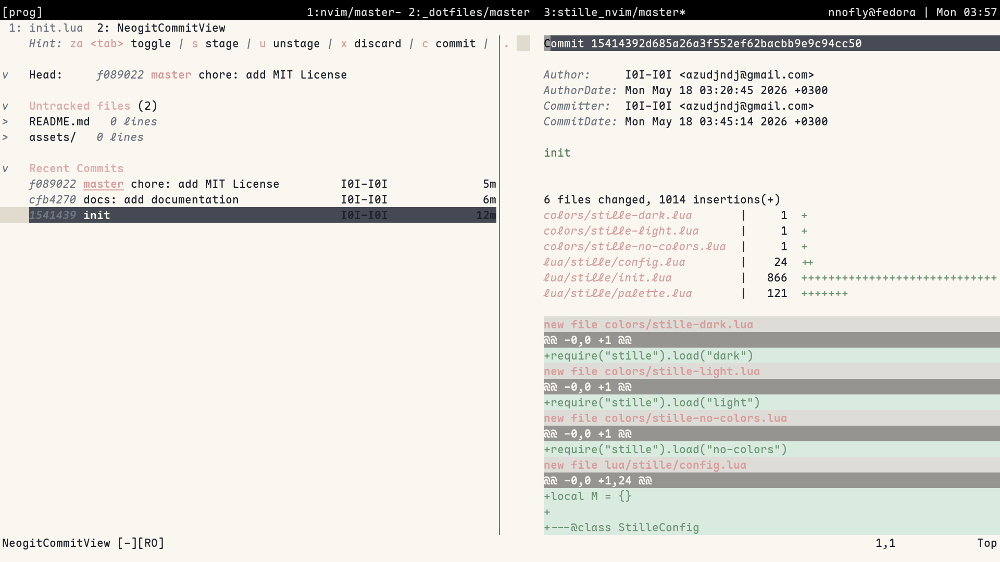
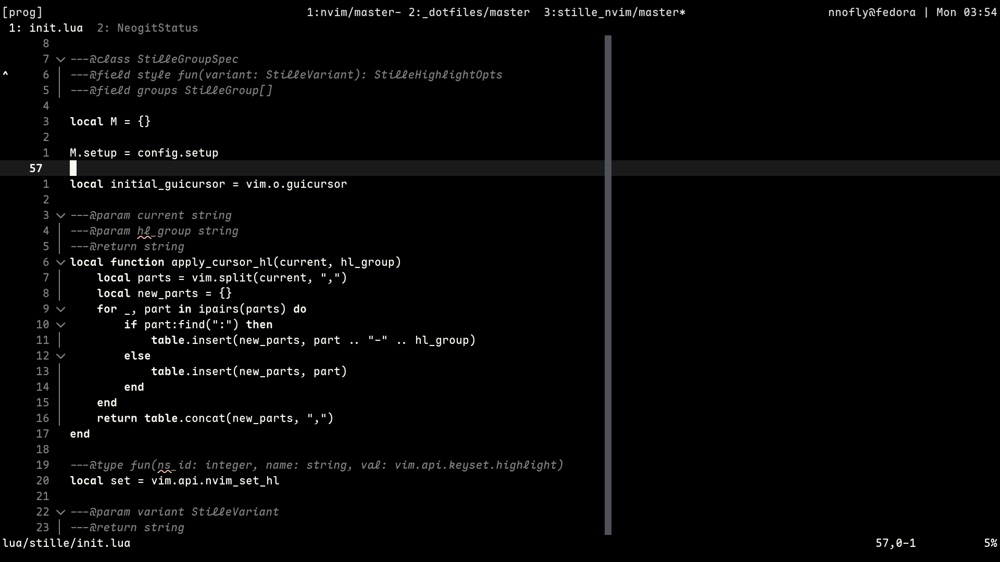

# stille.nvim

A minimalist, focused colorscheme for Neovim that prioritizes readability and reduces visual noise.

## Installation

### [lazy.nvim](https://github.com/folke/lazy.nvim)

```lua
{
  "I0I-I0i/stille.nvim",
  lazy = false,
  priority = 1000,
  config = function()
    require("stille").setup({
      -- your configuration here
    })
    vim.cmd.colo("stille-dark") -- or stille-light, stille-no-colors
  end,
}
```

### Built-in pack

```lua
vim.pack.add({ "https://github.com/I0I-I0I/stille.nvim" })
```

## Variants

### Stille dark

```vim
:colorscheme stille-dark
```

- Editor



- NeoGit



### Stille light

```vim
:colorscheme stille-light
```

- Editor



- NeoGit



### Stille no colors

```vim
:colorscheme stille-no-colors
```

- Editor



- NeoGit


## Configuration

```lua
require("stille").setup({
    transparent = false,      -- Enable/disable background transparency
    terminal_colors = true,   -- Enable/disable terminal colors
    comment_italic = true,    -- Enable/disable italics for comments
    guicursor = true,         -- Enable/disable cursor styling
    color_overrides = {},     -- Override specific palette colors
})
```

### Color Overrides

You can override any color in the palette:

```lua
require("stille").setup({
  color_overrides = {
    bg = "#000000",
    fg = "#ffffff",
    -- see lua/stille/palette.lua for all available keys
  }
})
```

## License

MIT
