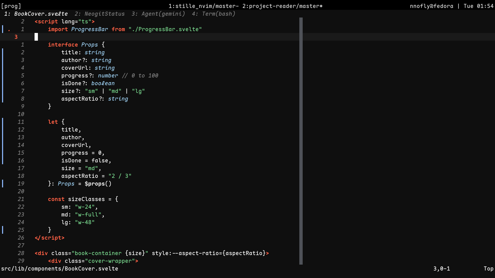
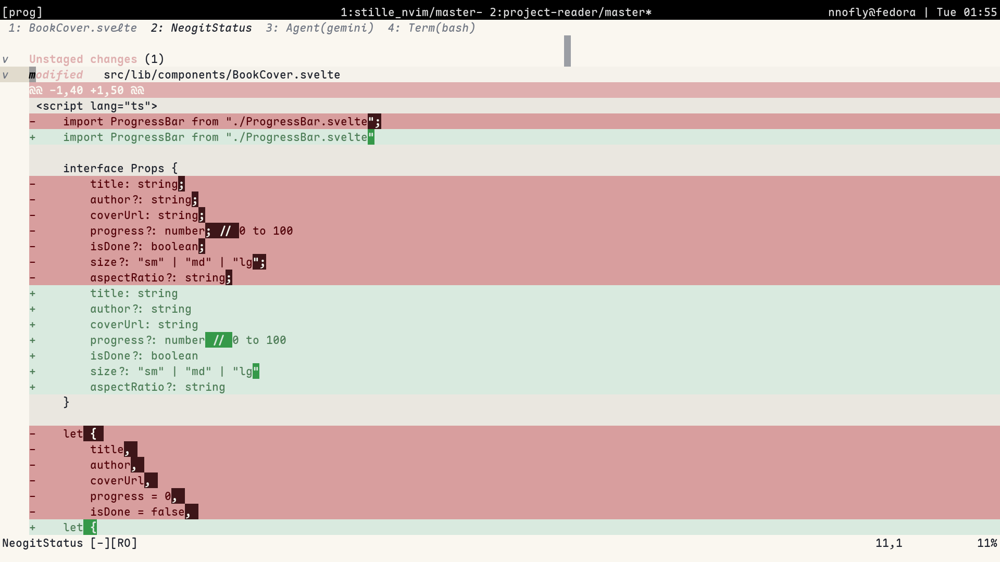
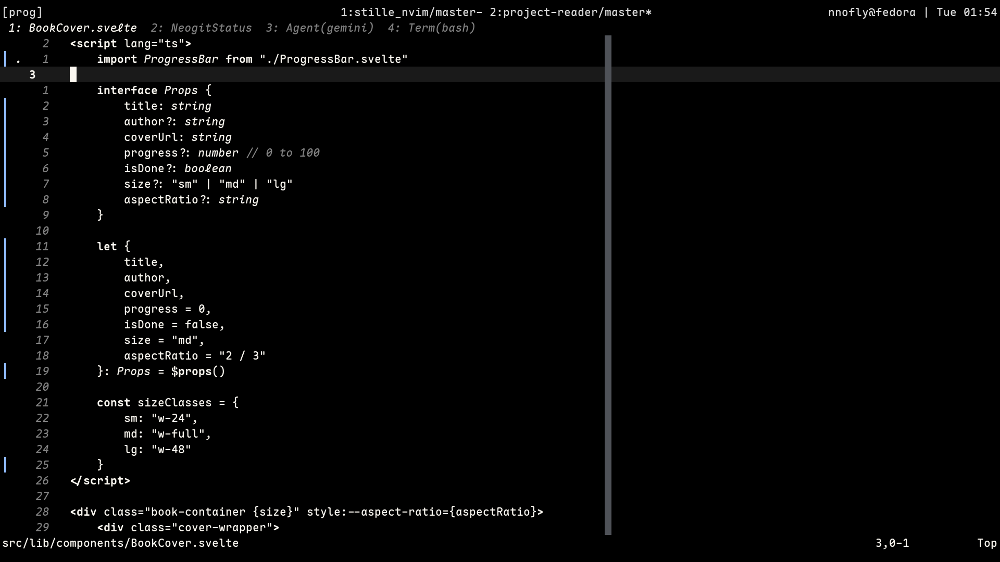
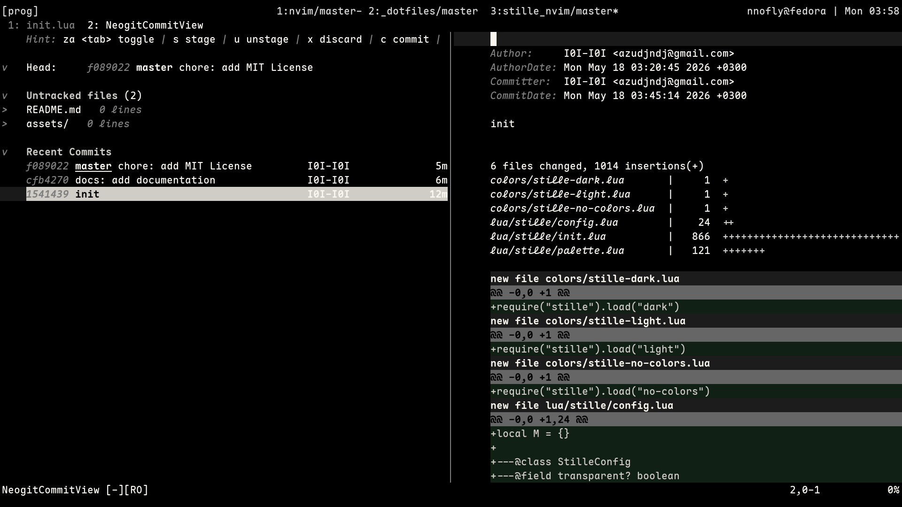

# stille.nvim

**stille** /'ʃtɪlə/ · *noun* — stillness, silence, quietness.

## Installation

### [lazy.nvim](https://github.com/folke/lazy.nvim)

```lua
{
    "I0I-I0I/stille.nvim",
        lazy = false,
        priority = 1000,
        config = function()
            require("stille").setup({
                -- your configuration here
            })
        vim.cmd.colo("stille-dunkel") -- or stille-hell, stille-leere
    end,
}
```

### Built-in pack

```lua
vim.pack.add({ "https://github.com/I0I-I0I/stille.nvim" })
vim.cmd.colo("stille-dunkel") -- or stille-hell, stille-leere
```

## Variants

### Stille dunkel

```vim
:colorscheme stille-dunkel
```

- Editor



- NeoGit


### Stille hell

```vim
:colorscheme stille-hell
```

- Editor


- NeoGit



### Stille leere

```vim
:colorscheme stille-leere
```

- Editor



- NeoGit



## Configuration

```lua
require("stille").setup({
    transparent = false,      -- Set background to "NONE" in main palette
    terminal_colors = true,   -- Enable/disable terminal colors
    comment_italic = true,    -- Set italic property in comment palette
    guicursor = true,         -- Enable/disable cursor styling
    color_overrides = {},     -- Override specific palette colors
})
```

### Color Overrides

You can override any color in the palette using highlight tables:

```lua
require("stille").setup({
    color_overrides = {
        main = { bg = "#000000", fg = "#ffffff" },
        comment = { fg = "#808080", italic = true },
        -- see lua/stille/palette.lua for all available keys
    }
})
```

## License

MIT
